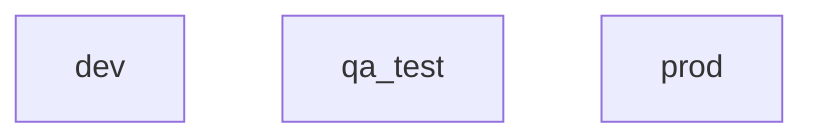

<small>**SDEVEN Software Development & Engineering Methodology**</small>

Version: 7.0.13 
Release date: 230806

***

# System Software Testing (SDEVEN.25-SYTEST)

**Table of Content**

[TOC]

## Preliminaries

The testing is one of the most important activity in software development as long as a piece of software is NOT written for own purposes.

### Why

The testing may *assure* you that a piece of software do what was intended to do. This is "one face" but testing must also assure the *owner* of the software for the same things. And finally must assure the *end users* (generally the customer) for same things, sometimes more things.

### When

The testing should be done first "internally" (ie, not in the presence of customer's people). Then some more complex, elaborated tests should be done in the customer presence (for customer confidence).

### Vocabulary

The testing process will involve some specific  terms and concepts like: *compliance*, *bug*, *acceptable*, *workaround solution*, ... These terms are not necessarily new terms but they will make more sense, will get a more clear meaning  "if are seen" from testing perspective.

## Test types

<!-- -#FIXME drop image when finish -->

* -#TODO ideas ref section content:
    * unit,
    * functional
    * integration 

## Testing and working environments

<!-- -#FIXME drop image when finish -->

* -#TODO ideas ref section content:
    * [x] discuss about environments, what are good for and what is the idea
    * make a flow ref how "information flow" from one environment to other (a sequence diagram is perfect)
    * **development** environment
    * **qa test** environment
    * **production** environment
    * disc ref who has rights and who does what when
    * set a WARNING ref production environment

### Why need for more environments 

The basic assumption of testing theory is: **the final produced system must run on different machines** than those where it was produced.

Using more than one environment is a *must* because:

* anyway you use at least two environments, the one **where you develop tge software** and another one **where the system application will be installed** to be used

* these two environments are *not guaranteed to be identical* and the one where the system application will be installed you even do *not know "how it looks like"* - the only thing you can do is to make some recommendations but that's all

* so, at least an environment where you'll test the system is absolutely necessary and this should be different that the one where you developed (or still developing) the system

### Information flow between environments

## Test deliverables

<!-- -#FIXME drop image when finish -->

* -#TODO ideas ref section content:
    * Test Plan
    * Test Scenarios
    * System Requirements
    * to make some templates for each one

