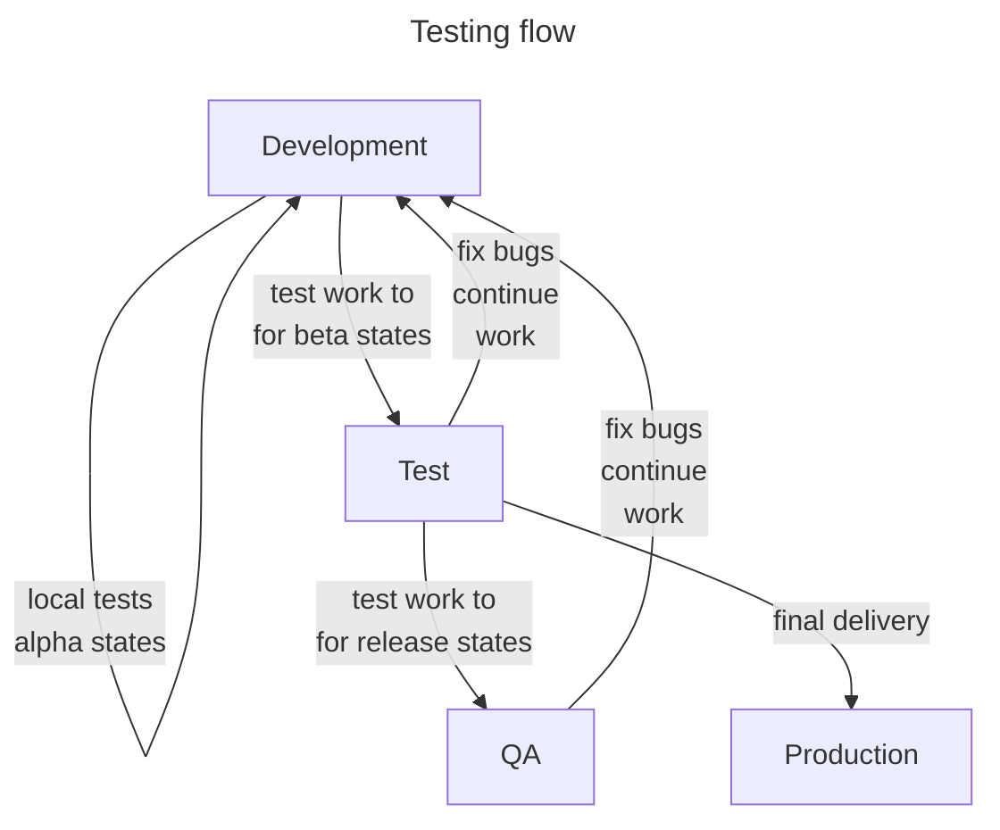

<small>**SDEVEN Software Development & Engineering Methodology**</small>

Version: 7.0.13 
Release date: 230806

***

# System Software Testing (SDEVEN.25-SYTEST)

**Table of Content**

[TOC]

## Preliminaries

The testing is one of the most important activity in software development as long as a piece of software is NOT written for own purposes.

### Why

The testing may *assure* you that a piece of software do what was intended to do. This is "one face" but testing must also assure the *owner* of the software for the same things. And finally must assure the *end users* (generally the customer) for same things, sometimes more things.

### When

The testing should be done first "internally" (ie, not in the presence of customer's people). Then some more complex, elaborated tests should be done in the customer presence (for customer confidence).

### Vocabulary

The testing process will involve some specific  terms and concepts like: *compliance*, *bug*, *acceptable*, *workaround solution*, ... These terms are not necessarily new terms but they will make more sense, will get a more clear meaning  "if are seen" from testing perspective.

## Test types

<!-- -#FIXME drop image when finish -->

* -#TODO ideas ref section content:
    * unit,
    * functional
    * integration 

## Testing and working environments

### Why need for more environments 

The basic assumption of testing theory is: **the final produced system must run on different machines** than those where it was produced.

Using more than one environment is a *must* because:

* anyway you use at least two environments, the one **where you develop tge software** and another one **where the system application will be installed** to be used

* these two environments are *not guaranteed to be identical* and the one where the system application will be installed you even do *not know "how it looks like"* - the only thing you can do is to make some recommendations but that's all

* so, at least an environment where you'll test the system is absolutely necessary and this should be different that the one where you developed (or still developing) the system

### Environments and  Information flow

!!! warning  "Production environment"
    Production environment is a **real & live** environment, where our customers work and operate their current business. **IT IS COMPLETELY FORBIDDEN TO ACCESS THAT ENVIRONMENT FOR NOT AUTHORIZED PERSONNEL .**

The next diagram shows the most basic flow of testing without extending it after delivery of product.

Diagram reveal the following environments:

* **development** aka **dev**
* **test**
* **qa**
* <small markdown>**qa-test** combined `qa` & `test`</small>
* **production** aka **prod**

Each one will be treated in details in next sections.

### **Development** environment

The *development environment* means *all systems and tools you use to develop the software system* (application, product, etc). These could be on more than one device (for example use a phone or tablet to edit some files, a git repository to store them and a laptop to make some compilation, a git client to manipulate its data, a IDE tool to edit code, a compiler to compila code, etc) the idea being that development environment does not means necessarily one device.

Could be situation when some simple devices are not enough to finalize a development step and a  more powerful machine, a server is needed in that process. In this situations, dedicated servers are used for development and they are called *development servers*.

The development environment is very *tight and dedicated* to a project and is not recommend to be reused from one project to another. Development environment is also very specific to a person, each developer having his affinity, preferences and productivity by using different tools, and *AS LONG AS THIS DOES NOT CREATE INTERFACE PROBLEMS* with the other team members or *LICENSING ISSUES*, its perfectly to use them (this is frequently happen for code IDEs and editors).

>So the development environment life is limited to one project or even only to  a phase of a project. Development environment can contain all things that developer (or the team if use a development server) consider necessary to use. Especially when using development servers *it is very useful if the development language / framework allow for some instruments to isolate environments* and clearly the should be used (examples are: `Poetry` or `venv` for Pyrhon, `composer` for PHP and Laravel, `cargo` for Rust, etc).

!!! info "Resulted version quality"
    Software versions resulted from development environment ***cannot be "rated" more than `alpha`***.

### **Test** environment

<!-- -#FIXME drop image when finish -->

### **QA** environment

<!-- -#FIXME drop image when finish -->

### **Production** environment

<!-- -#FIXME drop image when finish -->

## Test deliverables

<!-- -#FIXME drop image when finish -->

* -#TODO ideas ref section content:
    * Test Plan
    * Test Scenarios
    * System Requirements
    * to make some templates for each one

