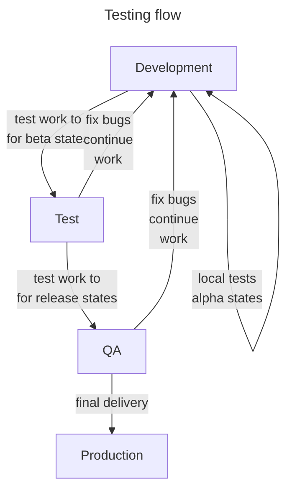
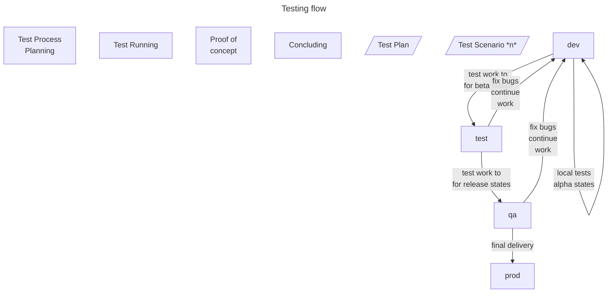

<small>**SDEVEN Software Development & Engineering Methodology**</small>

Version: 7.0.13 
Release date: 230807

***

# System Software Testing (SDEVEN.25-SYTEST)

**Table of Content**

[TOC]

## Preliminaries

The testing is one of the most important activity in software development as long as a piece of software is NOT written for own purposes.

### Why

The testing may *assure* you that a piece of software *do what was intended to do*. This is "one face" but testing must also assure the *owner* of the software for the same things. And finally must assure the *end users* (generally the customer) for same things, sometimes more things.

### When

The testing should be done (conducted) first "internally" (ie, not in the presence of customer's people). Then some more complex, elaborated tests should be done in the customer presence (for customer confidence).

### Vocabulary

The testing process will involve some specific  terms and concepts like: *compliance*, *bug*, *acceptable*, *workaround solution*, ... These terms are not necessarily new terms but they will make more sense, will get a more clear meaning  "if are seen" from testing perspective.

### Test types

In testing process more test types will be conducted. The *type of tests* can be seen from more perspectives, but those that relevant in this context are:

* access to code perspective:
    * *white box tests* - apply when code is known and can be accessed and test that code by expecting some behavior in known conditions
    * *black box tests* - apply without knowing the code but expecting some results for some given input - because they address functionalities these are called  **functional tests**

* scope / range of code impact perspective:
    * *unit, unitary* tests - these tests apply on small code blocks (for example a function or a procedure)
    * *integration* tests - these test address more complex portions of code and are mainly "looking for" their good working when interact one with others - in most cases these test are simply known as **acceptance tests**

* performance and compliance perspective:
    * *standards conformity* - these ones seek to demonstrate the system conformity to some standards or practices
    * *performance* - these ones seek to demonstrate the system performance in some given "stress" conditions, also from these tests results what is known as **System hardware requirements**

More details regarding test types is out this document scope. They are fundamental learning units in software engineering theory. The reason why some of them were listed here is to be aware that:

* they are used and applied in current job operations
* the other members of the team expect you to know what are them about

## Testing and working environments

The basic assumption of testing theory is: **the final produced system must be able run on different machines** than those where it was produced.

Using more than one environment is a *must* because:

* anyway you use at least two environments, the one **where you develop the software** and another one **where the system application will be installed** to be used

* these two environments are *not guaranteed to be identical* and the one where the system application will be installed you even do *not know "how it looks like"* - the only thing you can do is to make some recommendations but that's all

* so, at least an environment where you'll test the system is absolutely necessary and this should be different that the one where you developed (or still developing) the system

### Environments and  Information flow

!!! danger "Production environment"
    Production environment is a **real & live** environment, where our customers work and operate their current business. IT IS COMPLETELY **FORBIDDEN TO ACCESS** THAT ENVIRONMENT FOR NOT AUTHORIZED PERSONNEL.

The next diagram shows the most basic flow of testing without extending it after delivery of product.

Diagram reveal the following environments:

* **development** aka **dev**
* **test**
* **qa**
* **production** aka **prod**

!!! note "test & qa combined"
    In some projects `test` and `qa` environments are combined in a single one usually called `qa-test` or simply `test`, environment who takes on the role of both.

Each environment will be treated in details in next sections.

### **Development** environment

The *development environment* means *all systems and tools you use to develop the software system* (application, product, etc). These could be on more than one device (for example use a phone or tablet to edit some files, a git repository to store them and a laptop to make some compilation, a git client to manipulate its data, a IDE tool to edit code, a compiler to compile code, etc) the idea being that development environment does not means necessarily one device.

Could be situation when some simple devices are not enough to finalize a development step and a  more powerful machine, a server is needed in that process. In this situations, dedicated servers are used for development and they are called *development servers*.

The development environment is very *tight and dedicated* to a project and is not recommend to be reused from one project to another. Development environment is also very specific to a person, each developer having his affinity, preferences and productivity by using different tools, and *AS LONG AS THIS DOES NOT CREATE INTERFACE PROBLEMS* with the other team members or *LICENSING ISSUES*, its perfectly to use them (this is frequently happen for code IDEs and editors).

>So the development environment life is limited to one project or even only to  a phase of a project. Development environment can contain all things that developer (or the team if use a development server) consider necessary to use. Especially when using development servers *it is very useful if the development language / framework allow for some instruments to isolate environments* and clearly the should be used (examples are: `Poetry` or `venv` for Pyrhon, `composer` for PHP and Laravel, `cargo` for Rust, etc).

!!! info "Resulted version quality"
    Software versions resulted from development environment ***cannot be "graded" more than `alpha`***.

### **Test** environment

The *test environment* has the role to test the system on other completely different environment than the one in which development was made.

Doing so, any software components, libraries, code parts, text files characteristics, date or time stamps, user environment data, operating system configuration, or *other kind of system particular configuration* **WILL BE DETECTED** by making this kind of testing. Remember the basic objective of testing process: "*the final produced system must be able run on different machines*".

The ideal `test` environment is obtained by cloning an existing `production` environment and if necessary (in case the production machine is a "huge resources" one) make **only "quantitative"** adjustments, not qualitative ones (ie, downsize not downgrade).

>The test environment is MANDATORY to be limited to one project and one test phase. Other test phases will need another test environment. (The test process can alter enough the environment so other tests to be irrelevant).

!!! info "Resulted version quality"
    Software versions resulted from test environment are ***usually "graded" as `beta`***. But this depends more on type of tests conducted, ie, integration, functional, acceptance, etc.

!!! note "Testing team"
    Testing conducted in `test` are executed by and in **presence of producer team**. This is done exclusively in all cases is possible this not being a matter of confidence but a matter of fucus on "doing what you have to do and only this and now !" - see also the section ref `qa` environment.

### **QA** environment

The *qa environment* is absolutely identical with `test` environment and all things from `test` must be applied for `qa`. The only difference is regarding the presence of customer team.

!!! note "Testing team"
    Testing conducted in `qa` are executed in **presence of customer team** and this is mandatory. For particular / producer only tests, see the section ref `test` environment.

### **Production** environment

The *production environment* is the place where the customer business reflected by the (through) system is happening. Live, real, with real data and critical as functioning (at least from the provider perspective).

!!! danger "Production environment"
    Production environment is a **real & live** environment, where our customers work and operate their current business. IT IS COMPLETELY **FORBIDDEN TO** ACCESS THAT ENVIRONMENT FOR NOT AUTHORIZED PERSONNEL.

There are no more things to say about production environment except the warning, production environment should not be **accessed, modified, queried, etc, generally no operation**.

Any intervention required in production environment must be done **ONLY BY AUTHORIZED PERSONNEL AND ONLY WITH CUSTOMER WRITTEN PERMISSION.** Credentials for any component from production environment are subject of **customer strict confidential data and "secrets"**. The customer must be instructed **to change all credentials** used in environment setup phase.

All other operations regarding production environment (for example backup or update) are ONLY *customer responsibility*.

Any **copies of production environment** can be made ONLY by customer authorized personnel and obtained ONLY with customer representative consent.

!!! warning "Accepted version grades"
    In `production` environment only **`release`** graded versions are allowed to be installed. Only as exceptions and:
    * for ***critical business*** reasons
    * from trusted sources
    versions `beta` graded will be allowed

## Test deliverables

<!-- -#FIXME drop image when finish -->
{ width="300" }

-#TODO make some templates for each one

In order to be consistently applied and to be a proof of functioning, the testing process includes a series of *activities* and a set of *deliverables* that will be explained in next sections.

Deliverables that must be created are:

* **Test Plan**
* **Test Scenarios**
* **System hardware requirements**
* **Proof of Concept** document (aka **PoC** or **Acceptance** document)

All these deliverables must be formally agreed by customer.

The following diagram summarizes the testing process.

